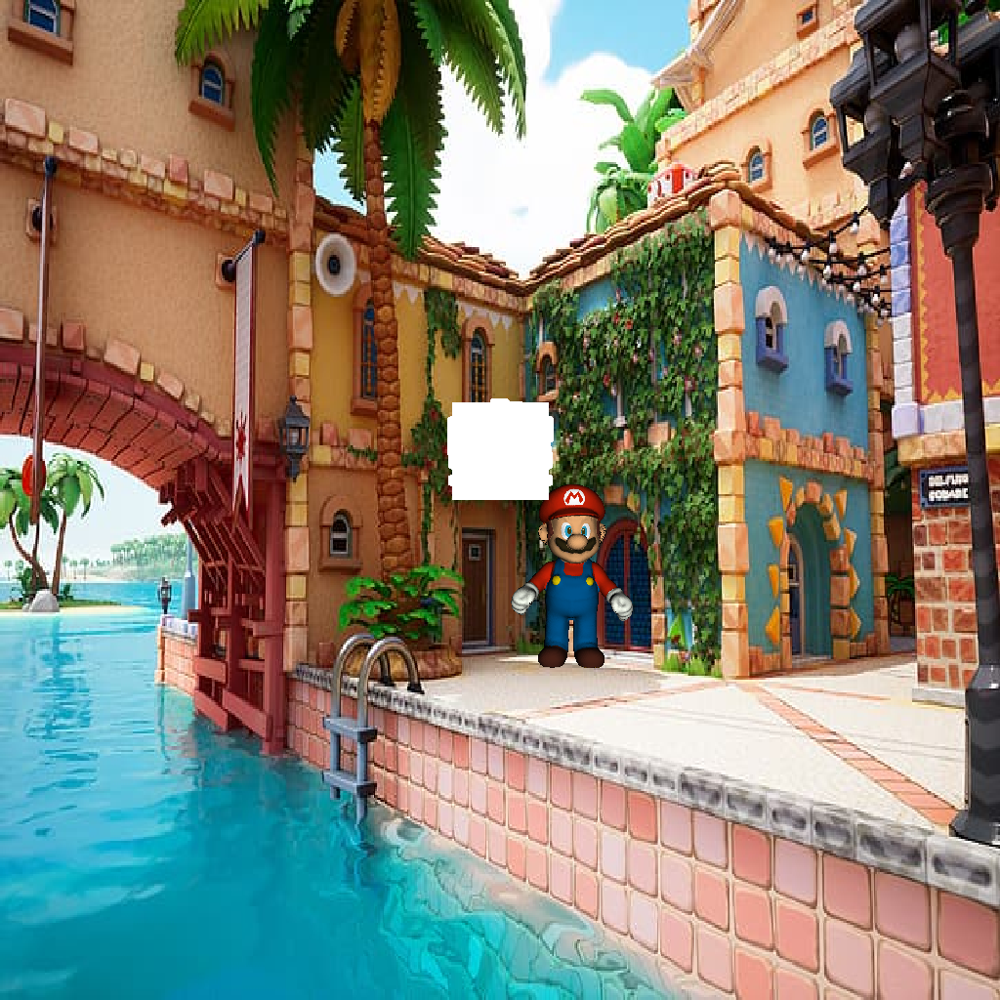

# Graficas Por Computadora - Renderer

## Como utilizar el Renderer
El proyecto tiene un archivo `main.go` el cual es el entrypoint para todo el proyecto. En el se encuentra el uso de el paquete `gl`.

Instrucciones de uso:
- 💽 Tener instalado el lenguaje Go en su computadora [Desde la pagina oficial](https://go.dev/doc/install).
- 🚀 Ejecutar el programa con el comando `go run main.go`.

Librerías Utilizadas:
- [fmt](https://pkg.go.dev/fmt) para imprimir en la pantalla.
- [log](https://pkg.go.dev/log) para imprimir mensajes de error y terminar el programa.
- [encoding/binary](https://pkg.go.dev/encoding/binary) para trabajar con numeros binarios
- [math](https://pkg.go.dev/math) para trabajar con funciones matemáticas como redondear, numeros aleatorios, etc.
## Ejercicio 01: Dibujando un punto.
Output: Una imagen en donde se dibujan estrellas fuera del viewport y adentro del viewport se dibujan pixeles al azar del mismo color. La imagen se puede ver en el archivo `out.bmp`

