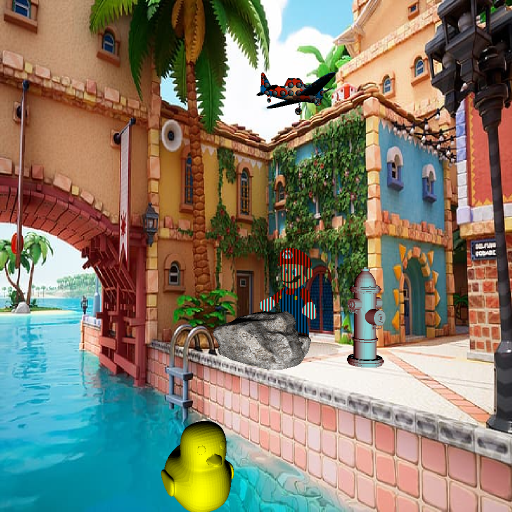

# Graficas Por Computadora - Renderer

## Como utilizar el Renderer
El proyecto tiene un archivo `main.go` el cual es el entrypoint para todo el proyecto. En el se encuentra el uso de el paquete `gl`.

Instrucciones de uso:
- 💽 Tener instalado el lenguaje Go en su computadora [Desde la pagina oficial](https://go.dev/doc/install).
- 🚀 Ejecutar el programa con el comando `go run main.go`.
## Ejercicio 01: Dibujando un punto.
Output: Una imagen en donde se dibujan estrellas fuera del viewport y adentro del viewport se dibujan pixeles al azar del mismo color. La imagen se puede ver en el archivo `out.bmp`

